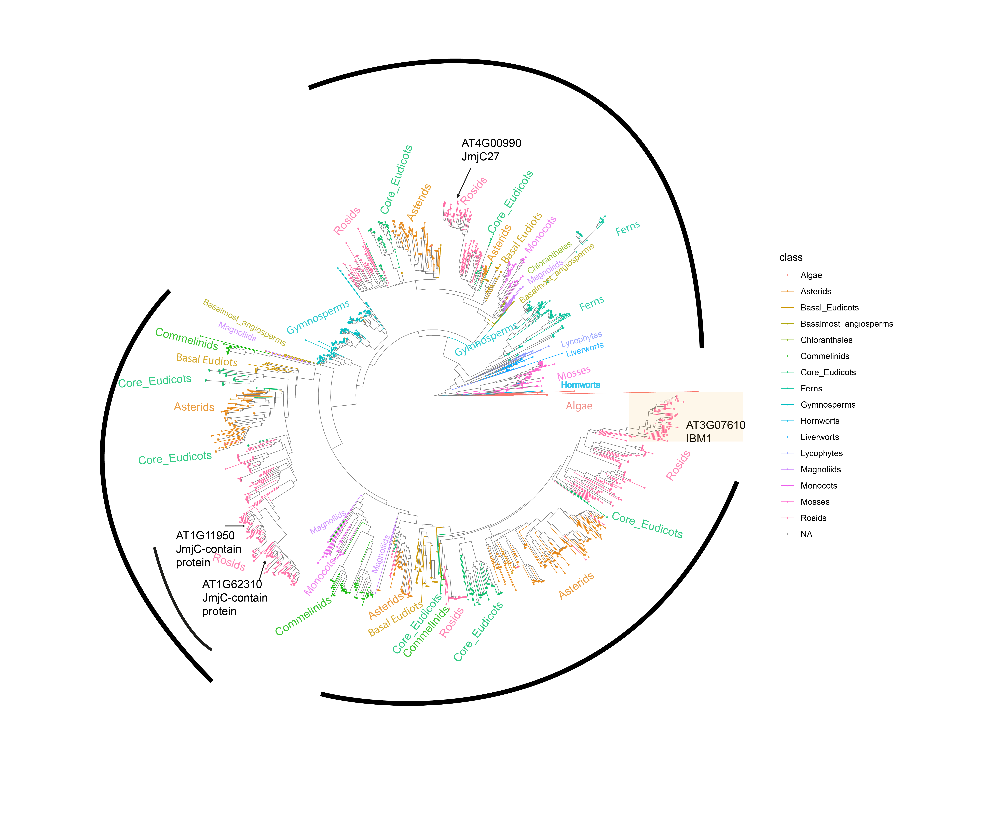
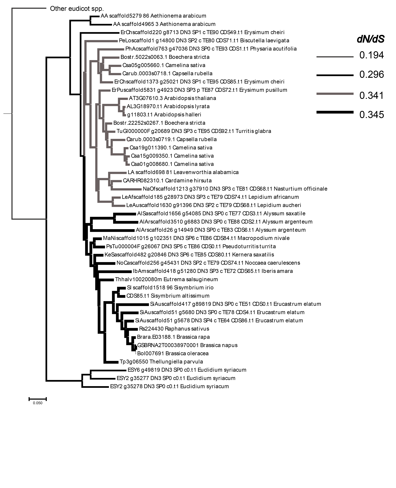
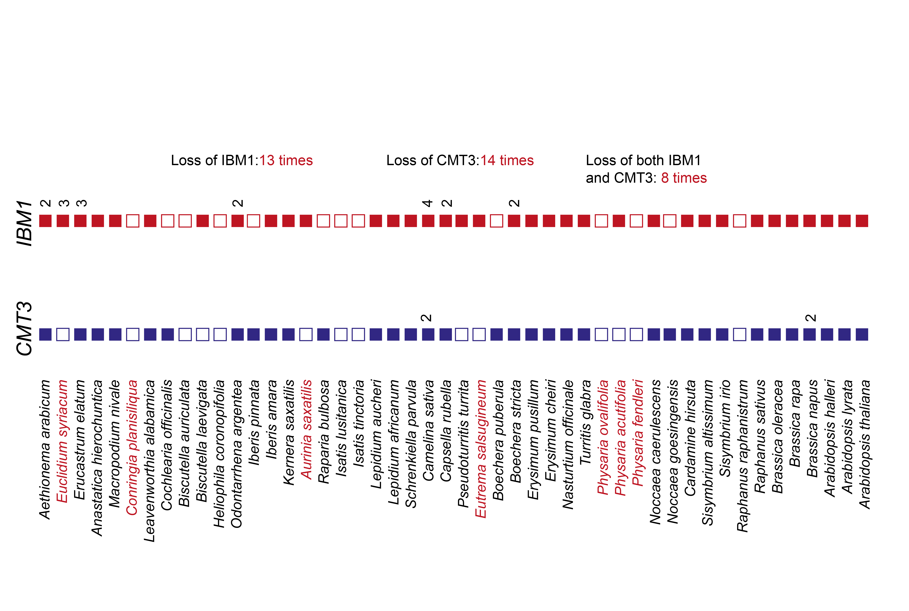
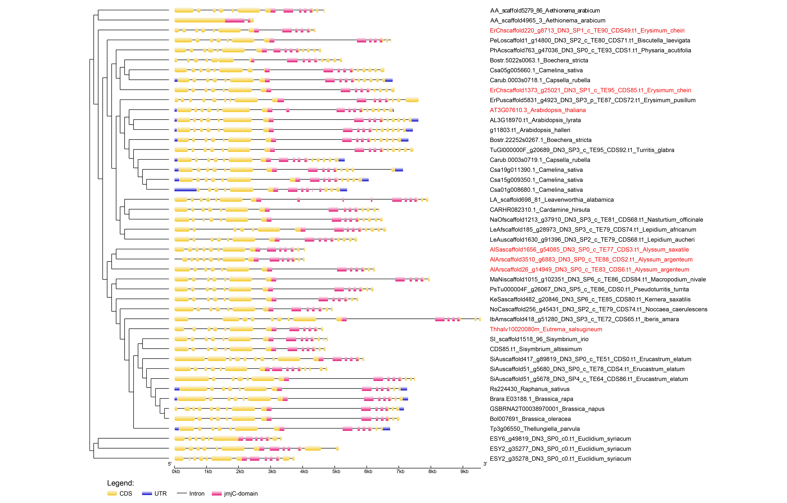

# background
IBM1 intronic methylation is a delicate system in maintainance homistatic of heterochromatin. 
but at the same time its a two-side sword. it remove h3k9me2 on genetic region, but it can also remove h3k9me on TE in cmt3/kyp mutants.
# question not solved
Its shown that the proper founction of IBM1 rely on proper methylation on the intronic region. how the sequence and methylation changed in IBM1 affect different species and influence speciation? 
# main objective of this project
investigate the evolution of IBM1. changes in intronic sequence and methylation TE repeats among species, potential coevolution of IBM1 and other enzyme(mainly CMT3) in this system. how this related to the distribution DNA methylation landscape and TE activity among different species.
# plans and their logic
1. evolution of jmjC protein family
2. potential coevolution of IBM1 and CMT3,maybe including other enzyme.
3. change of intronic sequence and methylation among species.
4. distribution of DNA methylation landscape and TE activity among different species.

# data collection
finally I need peptide sequence, backtransfered cds alignment after peptide alignment.
I also need genes's whole sequence information, so including intron sequence
## renaming the data I collected
to make piple more smooth, I need to rename all raw data with a consisitent naming system
speciesname.pep.fa
speciesname.cds.fa
## one kp
I do not need to do anything
## adam addition
extract target protain seq by mapping arab's target protein to peptide database
## additional brassicaceae
two situation.
1. same as adam addition. do the blast directly.
2. first using genome sequence and gff to get peptide database, then do the same thing as 1.
# extract best blast
done
# pfam
done
# alignment
done
# convert to condon alignment
done
# build plants kindom gene tree

# dN/dS selection test in brasecasea

# CMT3/IBM1 gene loss and gain in brasecasea (need further confirm)
done (need further confirm, make sure its deal to real loss, not from annotation error)

# Exploring in the large intron region of CMT3 loss species
intron length changes and methylation changes (partly done. exploring more methylome is needed)

# suggestions and ideas for next steps
1. Bob-find the IBM1 TE expression related paper  
2. Bob-this repeat are specific repeat or general repeats?  
3. Bob-repeats insertion /deletion happened randomly or from a common ancestor?  
4. Bob-what is the situation in other family  
5. Bob-methylation in intron could be a indicator of genome wide K9 methylation level  
6. Will- H3K4 paper about IBM1 and H3K4 relation  
7. Andy-motif analysis using meme  
8. Zack-dN/dS ration at different region of IBM1 protein  
9. Zefu-the repeat is different from true transponan, since they do not facilitate the accumulation of H3K9.  
So what is the type of those repeats?  
10. Zefu-combine more this type of intron methylation, see if there have some general pattern difference from transponable   elements.interms of H3K9 concentration, transpon type  
# select more species outside brassecacea
1. genome file and annotation file
2. extract their intron
# the next step is explore more about sequence of intron region 
1. extract the sequence in this region for all investigate species (48braceccea+other species) 
2. do the TE/repeat define analysis. repeatmarker,meme?
3. TE repeat dot related analysis among different species.
4. expand the evolution of IBM1 gene structure analysis to all species.
5. Analysis the TE insertion and deletion events are from a same common ancestor, or an events frequently happened among different linkage.
6. check if the gene loss/gain of CMT3/IBM1 analysis is reliable. to exclude the possibility of gene annotation error, maping arabidosis IBM1 gene directly to the whole genome reference. maybe also consider synteny analysis.
7. built the concatenate species tree pipeline  
find the single copy gene list  
extract the protein sequence for each gene and do the alignment  
concated all alignments  
build ML tree/bootstrap  
8. Trying to link the sequence and methylation changes in IBM1 to the methylation landscape.
