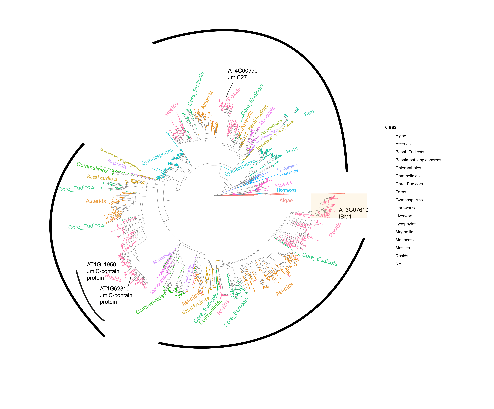
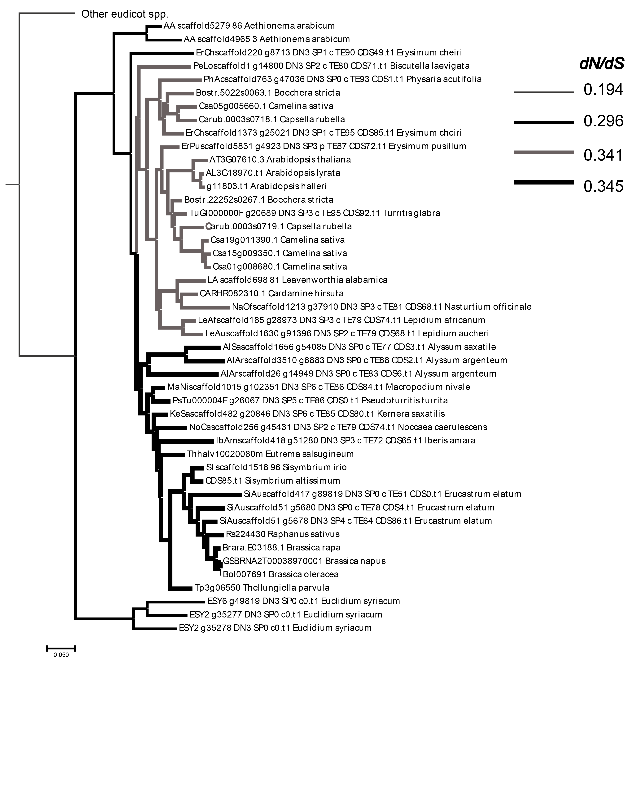
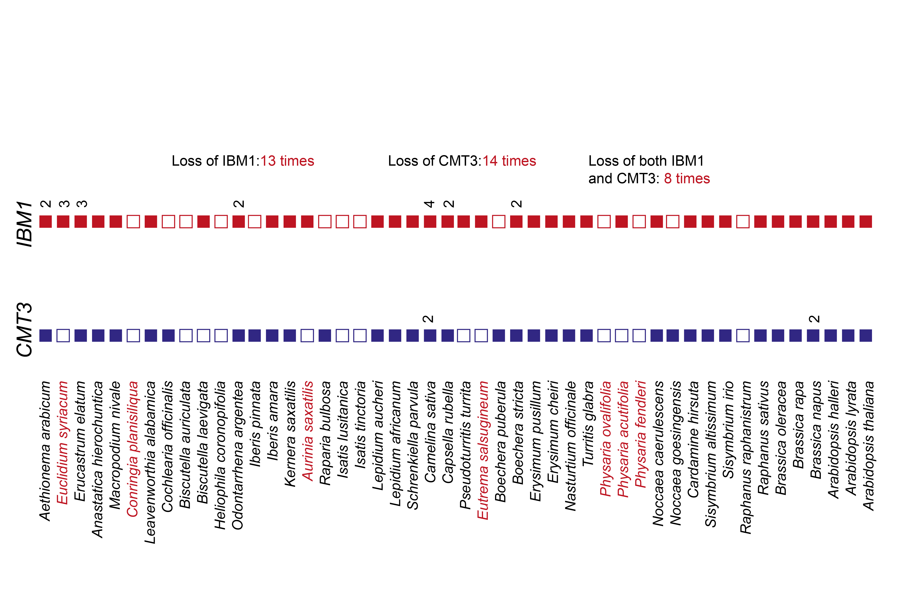
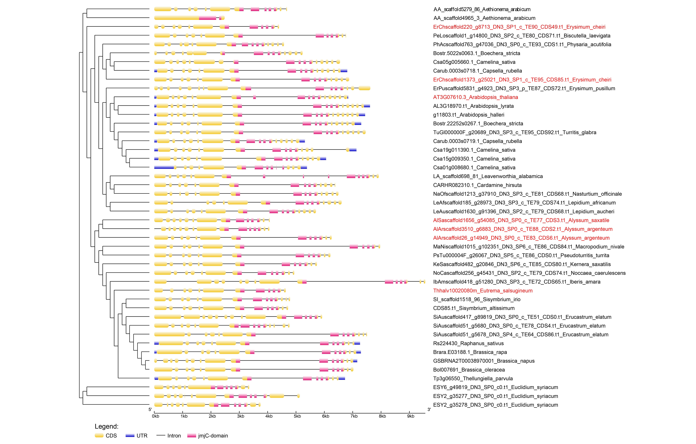

# data collection
finally I need peptide sequence, backtransfered cds alignment after peptide alignment.
I also need genes's whole sequence information, so including intron sequence
## renaming the data I collected
to make piple more smooth, I need to rename all raw data with a consisitent naming system
speciesname.pep.fa
speciesname.cds.fa
## one kp
I do not need to do anything
## adam addition
extract target protain seq by mapping arab's target protein to peptide database
## additional brassicaceae
two situation.
1. same as adam addition. do the blast directly.
2. first using genome sequence and gff to get peptide database, then do the same thing as 1.
# extract best blast
done
# pfam
done
# alignment
done
# convert to condon alignment
done
# build plants kindom gene tree

# dN/dS selection test in brasecasea

# CMT3/IBM1 gene loss and gain in brasecasea (need further confirm)
done (need further confirm, make sure its deal to real loss, not from annotation error)

# Exploring in the large intron region of CMT3 loss species
intron length changes and methylation changes (partly done. exploring more methylome is needed)

# suggestions and ideas for next steps
1. Bob-find the IBM1 TE expression related paper  
2. Bob-this repeat are specific repeat or general repeats?  
3. Bob-repeats insertion /deletion happened randomly or from a common ancestor?  
4. Bob-what is the situation in other family  
5. Bob-methylation in intron could be a indicator of genome wide K9 methylation level  
6. Will- H3K4 paper about IBM1 and H3K4 relation  
7. Andy-motif analysis using meme  
8. Zack-dN/dS ration at different region of IBM1 protein  
9. Zefu-the repeat is different from true transponan, since they do not facilitate the accumulation of H3K9.  
So what is the type of those repeats?  
10. Zefu-combine more this type of intron methylation, see if there have some general pattern difference from transponable   elements.interms of H3K9 concentration, transpon type  
# the next step is explore more about sequence of intron region 
1. extract the sequence in this region  
2. do the alignment  
3. do the meme analysis  
4. blast to tranponse database  
# built the species tree of brassecacea used in my analysis  
built the concatenate species tree pipeline
1. find the single copy gene list
2. extract the protein sequence for each gene and do the alignment
3. concated all alignments
4. build ML tree/bootstrap
